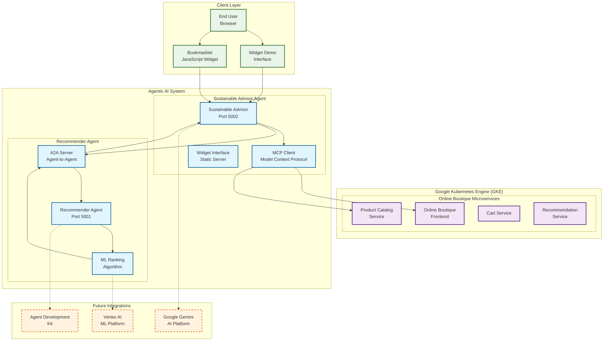
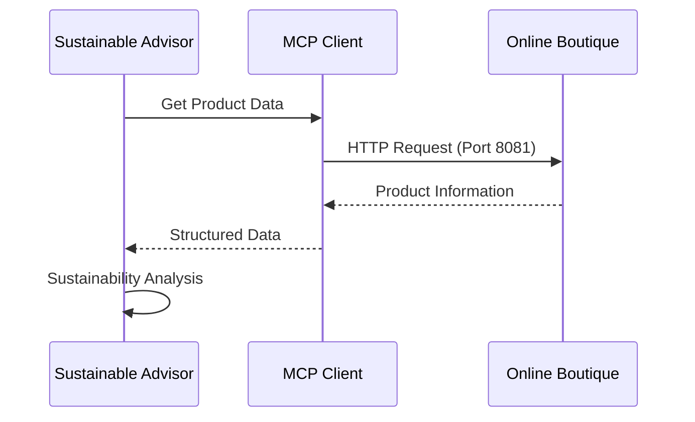
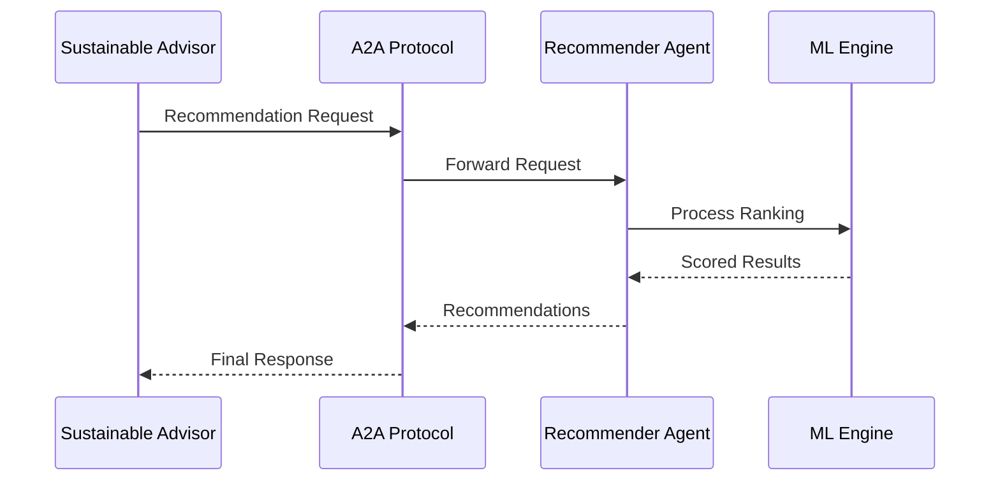
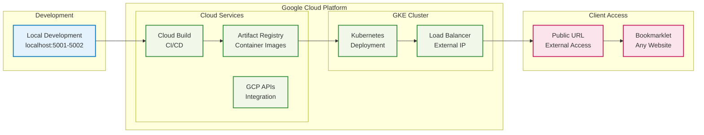

# Agentic AI Architecture Diagram

## System Overview

## Communication Protocols

### Model Context Protocol (MCP)

### Agent-to-Agent (A2A)

## Technology Stack

### Core Components
- **Google Kubernetes Engine**: Container orchestration
- **Flask APIs**: Microservice architecture
- **Python 3.9+**: Backend development
- **JavaScript ES6+**: Frontend interactions
- **Docker**: Containerization

### AI/ML Technologies
- **Agentic AI**: Multi-agent coordination
- **Model Context Protocol**: Structured communication
- **Agent-to-Agent**: Direct agent communication
- **Machine Learning**: Ranking algorithms

### Future Integrations
- **Google Gemini**: Advanced AI capabilities
- **Vertex AI**: ML model training
- **Cloud Functions**: Serverless processing
- **BigQuery**: Analytics and insights

## Deployment Architecture

## Data Flow

1. **User Interaction**: User visits e-commerce site and activates bookmarklet
2. **Widget Injection**: JavaScript widget injects into the current page
3. **MCP Communication**: Sustainable Advisor requests product data via MCP
4. **A2A Processing**: Recommendation request sent to Recommender Agent
5. **ML Analysis**: Multi-factor ranking with sustainability scoring
6. **Response Delivery**: Recommendations displayed in elegant widget interface

This architecture demonstrates true agentic AI with autonomous agents, structured communication protocols, and scalable cloud deployment.